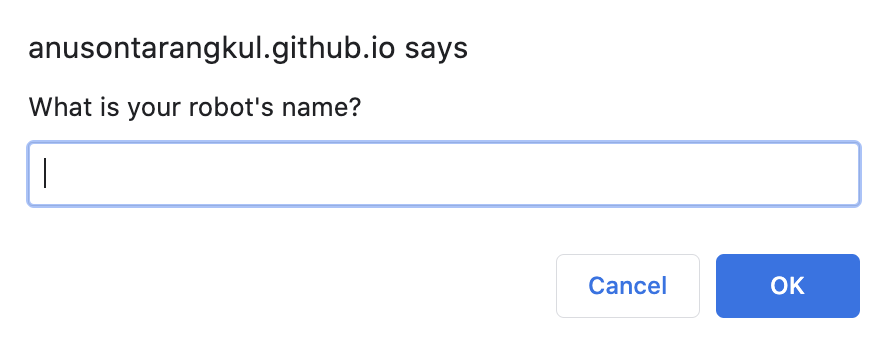
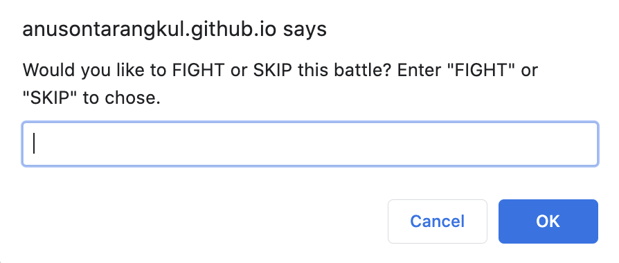

# Robot Gladiators

A Fun robot 🤖 attack game. You get to create a robot at the start. You will enter multiple rounds fighting enemy robots. You can choose to FIGHT or SKIP. You have health as well as the enemies. You also have a random attack point.

You can choose to SKIP a fight as well. Your scored is measured by the money you have. You can shop with the money for upgrade. Once you die or defeat all the enemies, the game is over.





## Table of Contents

|                                           |                                                               |                                                   |
| :---------------------------------------: | :-----------------------------------------------------------: | :-----------------------------------------------: |
| [Project Introduction](#Robot-Gladiators) |            [Table of Contents](#table-of-contents)            | [Development Highlights](#development-highlights) |
|          [Deployment](#deployed)          | [Description of Page Building](#Description-of-Page-Building) |       [Code Hightlights](#code-highlights)        |
|  [Technologies Used](#Technologies-Used)  |                      [Credits](#Credits)                      |                [License](#License)                |

## Development Highlights

- Dynamic game
- JavaScript window object
- For/While loops
- Switch conditions
- JavaScript math object
- Local Storage
- Input Validator

## Deployed

[Deployment](https://anusontarangkul.github.io/robot-gladiators/)

This app is deployed using GitHub pages.

## Description of Page Building

- In assets
  - JS Folder
    - Game script
  - In screenshots
    - screenshots for README
- In Root
  - index page
  - LICENSE
  - README

## Code Highlights

Object oriented design to create players.

```JavaScript

var playerInfo = {
    name: getPlayerName(),
    health: 100,
    attack: 10,
    money: 10,
    reset: function () {
        this.health = 100;
        this.money = 10;
        this.attack = 10;
    },
    refillHealth: function () {
        if (this.money >= 7) {
            this.health += 20;
            this.money -= 7;
        } else {
            window.alert("You don't have enough money!");
        }

    },
    upgradeAttack: function () {
        if (this.money >= 7) {
            window.alert("")
        }
        this.attack += 6;
        this.money -= 7;
    }
}
```

Shop function using switch cases to allow players to make different choices.

```JavaScript
var shop = function () {
    // ask player what they'd like to do
    var shopOptionPrompt = window.prompt('Would you like to REFILL your health, UPGRADE your attack, or LEAVE the store? Please enter "1" for REFILL, "2" for UPGRADE, or "3" for LEAVE.');
    shopOptionPrompt = parseInt(shopOptionPrompt);
    switch (shopOptionPrompt) {
        case 1:
            playerInfo.refillHealth();
            break;
        case 2:
            playerInfo.upgradeAttack();
            break;
        case 3:
            window.alert("Leaving the store.");
            break;
        default:
            window.alert("You did not pick a valid option. Try again.");
            shop();
            break;
    }
}
```

Local Storage to save high score

```JavaScript
    if (playerInfo.money > highScore) {
        localStorage.setItem("highscore", playerInfo.money);
        localStorage.setItem("name", playerInfo.name);
        alert(playerInfo.name + " now has the high score of " + playerInfo.money + "!");
    } else {
        alert(playerInfo.name + " did not beat the high score of " + highScore + ". Maybe next time!");
    }

    // play again
    var playAgainConfirm = window.confirm("Would you like to play again?");
    if (playAgainConfirm) {
        startGame()
    }
    else {
        window.alert("Thank you for playing Robot Gladiators! Come back soon!");
    }

```

## Technologies Used

- HTML
- JavaScript

## Credits

|                           |                                                                                                                                                                                                       |
| ------------------------- | ----------------------------------------------------------------------------------------------------------------------------------------------------------------------------------------------------- |
| **David Anusontarangkul** | [ LinkedIn](https://www.linkedin.com/in/anusontarangkul/) [ GitHub](https://github.com/anusontarangkul) |

## License

[](https://opensource.org/licenses/MIT)
